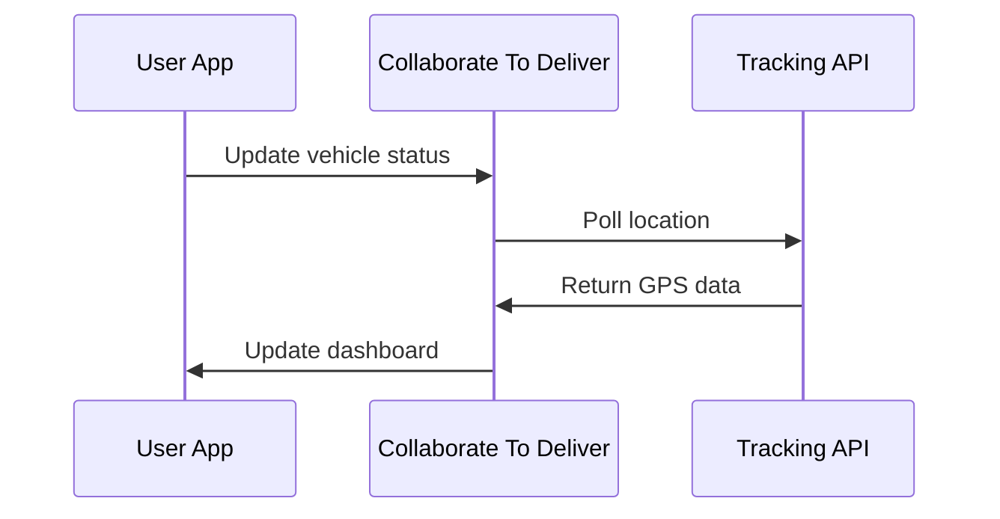

## Overview

Extend Collaborate To Deliver by integrating with external services. Use webhooks for real-time notifications on parking spot changes or vehicle status updates. Connect to logistics platforms for automated dispatch and vehicle tracking systems for live location data. For advanced needs, leverage the REST API for custom integrations.

<Callout kind="tip">
Review your plan's integration limits in the dashboard before setting up multiple connections.
</Callout>

## Integration Options

Discover key ways to connect Collaborate To Deliver with your ecosystem.

<Columns cols={2}>
  <Card title="Webhooks" icon="zap" href="#webhooks">
    Receive instant notifications for events like spot occupancy or maintenance alerts.
  </Card>
  <Card title="Logistics Tools" icon="truck" href="#logistics">
    Sync with platforms like Zapier or custom dispatch systems.
  </Card>
  <Card title="Vehicle Tracking" icon="map-pin" href="#tracking">
    Integrate GPS providers for real-time vehicle positions.
  </Card>
  <Card title="Custom API" icon="code" href="#api">
    Build tailored solutions using full API access.
  </Card>
</Columns>

## Setting Up Webhooks

Configure webhooks to get push notifications on key events.

<Steps>
  <Step title="Create Webhook" icon="plus">
    Navigate to Settings > Integrations in your dashboard. Click "New Webhook" and enter your endpoint URL, such as `https://your-webhook-url.com/webhook`.
  </Step>
  <Step title="Select Events" icon="list">
    Choose events like `spot_occupied`, `spot_freed`, or `vehicle_status_changed`.
  </Step>
  <Step title="Verify and Test" icon="check-circle">
    Save the webhook and trigger a test event. Check your endpoint logs for the payload.
  </Step>
</Steps>

Example webhook payload for a spot becoming occupied:

<Response show-lines="false">
```json
{
  "event": "spot_occupied",
  "data": {
    "spot_id": "platz-1-16",
    "location": "Ingolstadt",
    "vehicle_id": "veh-123",
    "timestamp": "2024-10-15T14:30:00Z",
    "occupancy": 94
  }
}
```
</Response>

Handle the payload in your server:

<CodeGroup tabs="Node.js,Python">
````javascript
const express = require('express');
const app = express();
app.use(express.json());

app.post('/webhook', (req, res) => {
  const event = req.body.event;
  const data = req.body.data;
  
  if (event === 'spot_occupied') {
    console.log(`Spot ${data.spot_id} occupied by ${data.vehicle_id}`);
    // Update your logistics system
  }
  
  res.status(200).send('OK');
});
````

````python
from flask import Flask, request, jsonify

app = Flask(__name__)

@app.route('/webhook', methods=['POST'])
def webhook():
    event = request.json['event']
    data = request.json['data']
    
    if event == 'spot_occupied':
        print(f"Spot {data['spot_id']} occupied by {data['vehicle_id']}")
        # Update your logistics system
    
    return jsonify({'status': 'OK'}), 200
````
</CodeGroup>

## Logistics Integrations

Connect to external tools for seamless dispatch.

<Tabs>
  <Tab title="Zapier" icon="zap">
    Use Zapier to trigger actions on webhook events.
    
    <ParamField header="X-Webhook-Signature" param-type="string" required="true">
      HMAC signature for payload verification.
    </ParamField>
  </Tab>
  <Tab title="Custom Logistics API" icon="truck">
    Send occupancy data to your backend.
    
    ```javascript
    fetch('https://your-logistics.example.com/dispatch', {
      method: 'POST',
      headers: { 'Authorization': 'Bearer YOUR_TOKEN' },
      body: JSON.stringify({
        spots_available: 2,
        location: 'Ingolstadt'
      })
    });
    ```
  </Tab>
</Tabs>

## Vehicle Tracking Systems

Sync live data from GPS providers.

<Expandable title="Integration Flow" default-open="true">



</Expandable>

Configure polling intervals in Settings > Tracking (default: every 30 seconds).

## Custom API Access

Build bespoke integrations with the REST API.

Base URL: `https://api.example.com/v1`

<ParamField query="api_key" param-type="string" required="true">
  Your API key from dashboard settings.
</ParamField>

<Request tabs="cURL,JavaScript">
```bash
curl "https://api.example.com/v1/parking-spots?location=Ingolstadt" \
  -H "Authorization: Bearer YOUR_API_KEY"
```

```javascript
const response = await fetch('https://api.example.com/v1/parking-spots?location=Ingolstadt', {
  headers: {
    'Authorization': 'Bearer YOUR_API_KEY'
  }
});
const spots = await response.json();
```
</Request>

<Callout kind="alert">
Secure your `API_KEY` and rotate it regularly. Never expose it in client-side code.
</Callout>

## Next Steps

Test your first integration with the webhook setup above. Explore the [API Reference](/api-reference) for more endpoints. Contact support for enterprise integration assistance.